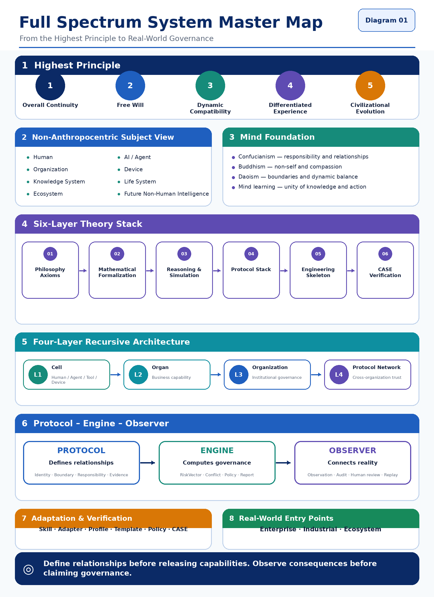

# Full Spectrum Commons

> Shared public diagrams, evidence terminology, research indexes and citation metadata for the Full Spectrum ecosystem. A diagram is an orientation aid, not proof that every depicted capability has shipped.

Shared maps, diagrams, indexes, glossary materials, and public coordination assets for the [Full Spectrum Lab](https://github.com/full-spectrum-lab) GitHub organization.

This repository is the canonical public navigation and terminology layer of the ecosystem.

It is not:

- the normative protocol source of truth;
- the runnable governance engine;
- the enterprise deployment package.

It is the place where a new reader can understand the whole landscape in a few minutes.

## Why this repository exists

Full Spectrum spans several layers:

- protocol definitions;
- local-first runtime;
- enterprise governance use cases;
- shared diagrams, indexes, and public orientation materials.

Without a commons layer, the ecosystem becomes hard to navigate. This repository solves that problem by acting as the shared public map.

## Repository roles

| Repository | Primary role | Main audience |
|---|---|---|
| `full-spectrum-protocol` | RFCs, schemas, boundary definitions, compatibility rules | protocol researchers, architects, governance contributors |
| `full-spectrum-engine` | local-first runnable governance runtime | developers, AI engineers, open-source contributors |
| `full-spectrum-knowledge-governance` | exact knowledge identity, version, provenance and lifecycle | knowledge stewards, developers, reviewers |
| `full-spectrum-observer` | authorized reality input, evidence, audit/replay and bounded review | operators, reviewers, enterprise evaluators |
| `full-spectrum-enterprise-governance` | enterprise-facing governance cases, adapters, reports, deployment patterns | enterprise teams, AI product owners, QA and compliance leads |
| `full-spectrum-commons` | cross-repo map, diagrams, glossary, public entry materials | first-time visitors, reviewers, collaborators |

## What belongs here

- shared diagrams and visual assets
- project maps and repository maps
- glossary and terminology references
- public-facing orientation materials
- cross-repository indexes
- reusable templates that are not specific to only one repository
- high-level release and ecosystem notes

## What does not belong here

- normative protocol definitions that should live in `full-spectrum-protocol`
- runnable code that should live in `full-spectrum-engine`
- enterprise-specific governance packages that should live in `full-spectrum-enterprise-governance`
- private customer data, private tokens, internal-only meeting notes, or unpublished sensitive material

## Start here

- [Start from Your Question](./docs/start-from-your-question.md) · [从你的问题开始](./docs/start-from-your-question.zh-CN.md)
- [Four Independent Engineering Tracks](./docs/four-independent-engineering-tracks.md)
- [START_HERE.md](./START_HERE.md)
- [Ecosystem Map](./ECOSYSTEM.md)
- [Repository Map](./REPO_MAP.md)
- [Diagrams Index](./diagrams/README.md)
- [Visual Index](./docs/visual-index.md)
- [Evidence and Project Status](./docs/evidence-and-status.md)
- [Holographic Governance Architecture Fact Baseline](./docs/holographic-governance-architecture-fact-baseline.md)
- [Research Index](./research/README.md)
- [Public Writing and Origins](./docs/public-writing-and-origins.md)
- [Public Adoption Ladder](./docs/public-adoption-ladder.md)
- [GitHub Stage-1 Community Plan](./docs/community-stage-1-github-plan.md)

## Recommended reading path

If you are new to Full Spectrum:

1. Start with [Start from Your Question](./docs/start-from-your-question.md)
2. Read [Four Independent Engineering Tracks](./docs/four-independent-engineering-tracks.md)
3. Read [START_HERE.md](./START_HERE.md)
4. Open [`diagrams/README.md`](./diagrams/README.md)
5. Go to `full-spectrum-observer` if you need the local application boundary
6. Go to `full-spectrum-engine` if you need runnable examples
7. Go to `full-spectrum-knowledge-governance` if you need exact knowledge identity and versioning
8. Go to `full-spectrum-protocol` if you need definitions and schemas
9. Go to `full-spectrum-enterprise-governance` if you need business-facing cases and governance packages

## Research and public writing

- [Citation metadata](./CITATION.cff) provides a standard GitHub citation entry; cite the exact release or commit used.
- [WP-001: Governance Semantics and a Local-First Observer Engine](./research/working-papers/wp-001-governance-semantics-and-local-observer-engine.md) is a public working paper grounded in the current repositories. It is not peer reviewed.
- [Legacy Manuscript Editorial Review](./research/working-papers/legacy-manuscript-review.md) records why older theory manuscripts are not presented as published evidence yet.
- [Public Writing and Origins](./docs/public-writing-and-origins.md) links the Douban book, Zhihu column, and official website while separating narrative background from normative specifications.

## Public boundary

This repository is for orientation and shared assets.

It does not claim:

- regulatory approval
- complete production readiness across all repositories
- legal authority over external systems
- that every diagram represents a finished implementation
- that all concepts shown here are already stabilized at protocol level

## License

See [LICENSE](./LICENSE).
