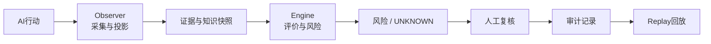

# Full Spectrum｜参赛与社区协作入口

这是 Full Spectrum 参加外部开源赛事的公开协作入口。

## 30 秒了解项目

Full Spectrum 研究如何让 AI 的行动具备清晰边界、依据、证据、风险提示、人工复核、审计和回放能力。

当前公开材料对应的是一个正在建设中的本地离线原型，不是已经部署到生产环境的产品。

```ini
PROJECT_STAGE = PUBLIC_BUILD_IN_PROGRESS
PRIMARY_CASE = FDE-TRIAL-001
EXECUTION_MODE = LOCAL_OFFLINE
PRODUCTION_APPLICATIONS = NONE
REAL_NETWORK = NOT_AUTHORIZED
PRODUCTION_READY = NO
```

## 我们要做什么

我们希望邀请项目外的人帮助完成一次诚实的压力测试：能否在不依赖真实外部系统的情况下，运行、理解并复核一条 AI 行动治理链。

## 先选择你的路径

1. **只想快速体验**：先看 [QUICKSTART](QUICKSTART.md)。
2. **想理解架构**：看下面的链路和 [证据索引](EVIDENCE.md)。
3. **想参与贡献**：阅读 [社区任务](TASKS.md) 和 [贡献与条件奖励规则](CONTRIBUTION_RULES.md)。
4. **想做严谨评估**：先看 [已知限制](KNOWN_LIMITATIONS.md)，再核对证据提交。

## 一条治理链



这张图表示目标治理链，不等同于生产部署声明。当前参赛主线仍以 FDE-TRIAL-001 的冻结合同和已发布证据为准。

## 从这里开始

- [快速开始（先跑或确认当前阻塞）](QUICKSTART.md)
- [社区任务](TASKS.md)
- [贡献与条件奖励规则](CONTRIBUTION_RULES.md)
- [已知限制](KNOWN_LIMITATIONS.md)
- [证据索引](EVIDENCE.md)

赛事截止时间、奖金和报名资格以主办方最终规则为准。本仓库不保证获奖，也不承诺固定奖金或固定分配比例。
