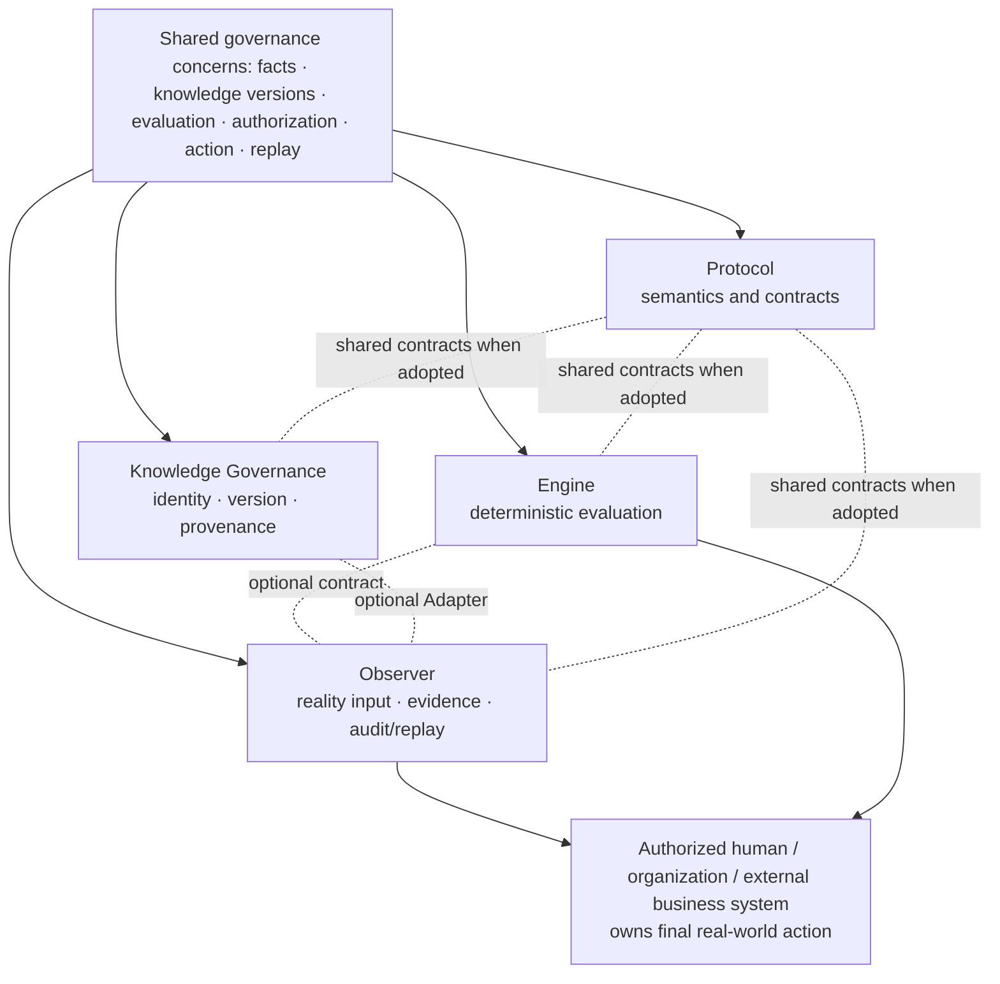

# Four independent engineering tracks and optional composition

创建时间：2026-08-01 12:18（北京时间，UTC+8）
最后更新时间：2026-08-01 12:18（北京时间，UTC+8）

> Current canonical public orientation. A diagram is explanatory, not implementation or release evidence.

## Boundary matrix

| Track | Responsible for | Not responsible for |
|---|---|---|
| [full-spectrum-protocol](https://github.com/full-spectrum-lab/full-spectrum-protocol) | Identity, capability, boundary, evidence and accountability contracts | Transport, planning or execution |
| [full-spectrum-engine](https://github.com/full-spectrum-lab/full-spectrum-engine) | Deterministic and reproducible governance evaluation | Arbitrary agent planning, tool execution or business action |
| [full-spectrum-knowledge-governance](https://github.com/full-spectrum-lab/full-spectrum-knowledge-governance) | Exact knowledge identity, version, provenance, lifecycle, conflict and replay | RAG retrieval, vector storage or automatic truth judgment |
| [full-spectrum-observer](https://github.com/full-spectrum-lab/full-spectrum-observer) | Authorized reality input, Observation, Evidence, Audit, Replay and bounded review | Generic APM/log monitoring or production control |

## Adoption rule

Choose only the track needed. Optional composition must bind exact versions, inputs, contracts, Known Limitations and Evidence. A downstream case does not modify a product's frozen requirements.

Machine-readable source: [ecosystem-manifest.json](https://github.com/full-spectrum-lab/.github/blob/main/ecosystem/ecosystem-manifest.json).
