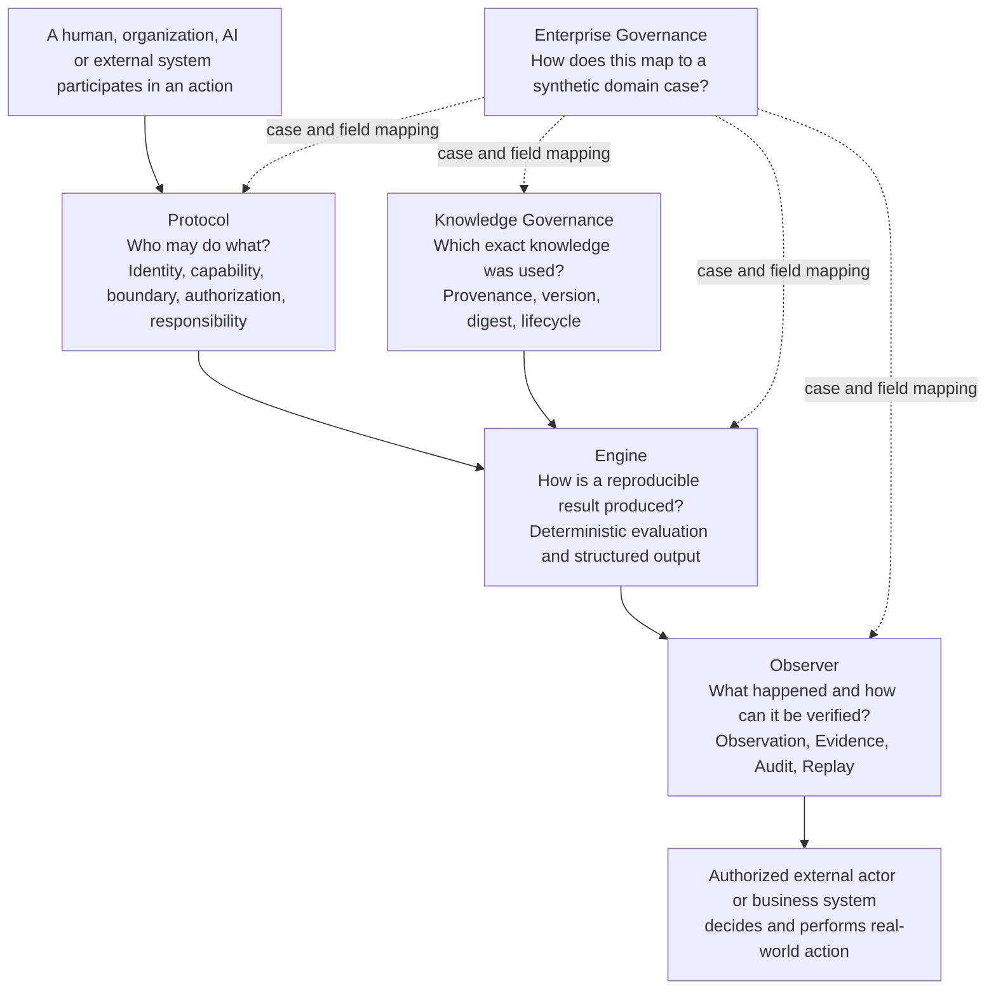

# Full Spectrum Public Architecture Map

Created at: 2026-09-16 22:05 UTC+8

Last updated at: 2026-09-16 22:05 UTC+8

Document status: `PUBLIC_ORIENTATION / NON_NORMATIVE`

This map is for first-time readers. It explains which repository answers which question. It is not a runtime topology, protocol specification or proof that every path has been implemented.

## Five questions



Engine, Observer and Knowledge Governance do not automatically execute the real-world action. Authority and responsibility remain with an authorized human, organization or external business system.

## Repository responsibilities

| Repository | Question answered | Explicit non-goal |
|---|---|---|
| Protocol | Who acts under which identity, capability and boundary? | Not transport, task planning or execution |
| Knowledge Governance | Which exact knowledge was used? | Not RAG, a vector database or automatic truth adjudication |
| Engine | How do fixed inputs and rules produce a reproducible result? | Not an Agent Runtime, Planner or Tool Executor |
| Observer | What happened, where is the Evidence, and can it be replayed? | Not APM, a production controller or final business judge |
| Enterprise Governance | How do contracts map to synthetic domain problems? | Not proof of named-customer deployment or production validation |
| Commons | Where can readers find terminology, evidence and research context? | Not a normative source, runtime or substitute for Release facts |

## Evidence descent

```text
Conceptual explanation
-> proposed governance principle
-> Protocol / Schema
-> code and tests
-> pinned execution
-> Evidence / Replay
-> scope-limited conclusion
```

Use [Evidence and Project Status](./evidence-and-status.md) and repository Releases for current capability claims.
