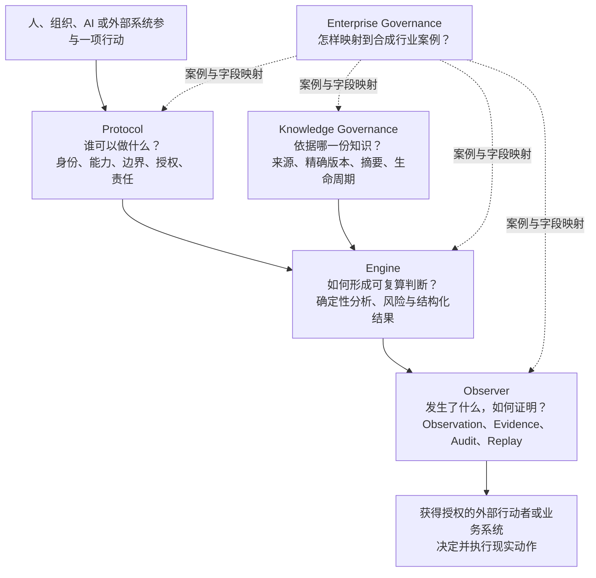

# Full Spectrum 公共架构图

创建时间：2026-09-16 22:05 UTC+8

最后更新时间：2026-09-16 22:05 UTC+8

文档状态：`PUBLIC_ORIENTATION / NON_NORMATIVE`

这张图面向第一次接触 Full Spectrum 的读者。它解释各仓库分别回答什么问题，不是运行时拓扑、协议规范或已完成能力证明。

## 先看五个问题



现实动作不由这张图中的 Engine、Observer 或 Knowledge Governance 自动执行。最终行动权和责任仍在获得授权的人、组织或外部业务系统。

## 每个仓库只承担自己的责任

| 仓库 | 它回答的问题 | 它不负责什么 |
|---|---|---|
| Protocol | 谁以什么身份、能力和边界行动？ | 不传输消息，不规划任务，不执行现实动作 |
| Knowledge Governance | 判断使用了哪一份精确知识？ | 不是 RAG、向量数据库或自动真理裁决器 |
| Engine | 固定输入和规则如何产生可复算结果？ | 不是 Agent Runtime、Planner 或 Tool Executor |
| Observer | 发生了什么，Evidence 在哪里，能否 Replay？ | 不是 APM 或生产控制器，不作最终业务裁决 |
| Enterprise Governance | 治理合同怎样映射到合成行业问题？ | 不证明具名客户部署或生产验证 |
| Commons | 新读者去哪里理解术语、证据和研究背景？ | 不是规范源、运行时或发布事实替代物 |

## 当前可以确认什么

- 各责任仓库已经公开代码、文档或示例；
- Engine、Observer 和 Knowledge Governance 存在各自的公开 Release 与范围化证据；
- Protocol 提供公开草案、Schema 和一致性检查；
- Enterprise Governance 提供合成或脱敏案例；
- 各仓库可以独立使用，组合必须依赖明确合同和固定版本。

## 当前不能据此推断什么

- 不能推断已经形成生产级跨组织治理网络；
- 不能推断完成一般兼容、真实网络或生产验证；
- 不能推断架构图中的所有路径均已集成运行；
- 不能推断任何 AI 获得了独立现实行动权；
- 不能把研究概念、路线图或图示当成实现证据。

## 证据回落顺序

```text
概念解释
→ 候选治理原则
→ Protocol / Schema
→ 代码与测试
→ 固定版本运行
→ Evidence / Replay
→ 范围化结论
```

阅读当前能力时，请从[证据与项目状态](./evidence-and-status.md)和各仓库 Release 开始。
