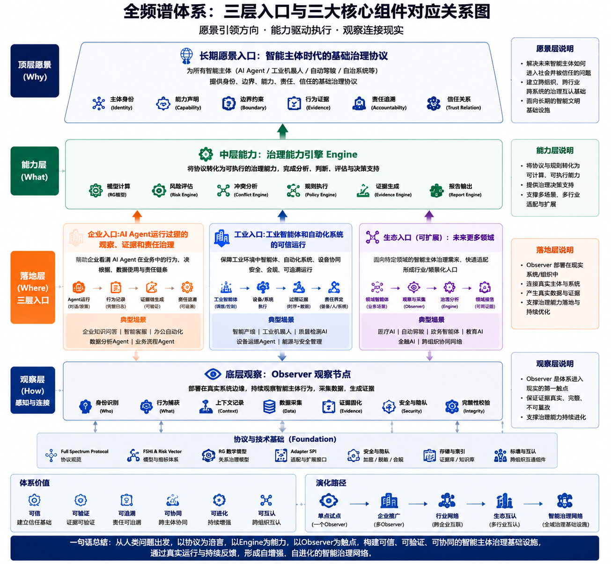

# Three Entry Paths and Three Core Components

> Public orientation note. The diagram describes the target relationship between layers; it is not evidence that every depicted capability has been implemented or production-validated.

## One-sentence model

**Protocol defines the governed subject and relationship, Engine provides deterministic governance capability, and Observer connects those capabilities to real environments through bounded observation, evidence and human review.**

中文：**Protocol 定义主体与治理关系，Engine 提供确定性治理能力，Observer 以有边界的观察、证据和人工复核连接现实环境。**

## The three core components

| Component | Primary responsibility | Public evidence today | Boundary |
| --- | --- | --- | --- |
| [Protocol](https://github.com/full-spectrum-lab/full-spectrum-protocol) | Identity, capability, boundary, evidence, accountability, object schemas and conformance rules | Specifications, schemas, examples and schema checks | Early public draft; not a final standard |
| [Engine](https://github.com/full-spectrum-lab/full-spectrum-engine) | Deterministic risk, conflict, policy, evidence and report generation | Runnable source, fixtures, tests, CI and releases | Does not make or execute final enterprise decisions |
| [Observer](https://github.com/full-spectrum-lab/full-spectrum-observer) | Local observation, evidence storage, audit/replay and bounded human-review workflow | Foundation kernel, compatibility adapter, gates and pre-release | Current public line is observer-only; later console capabilities remain roadmap items |

## The three entry paths

### Enterprise entry

Observe AI-agent behavior, business decisions and accountability without replacing the enterprise system of record. The Observer may be used through a browser or API; the organization keeps control of identity, data and final decisions.

### Industrial entry

Observe conflicts across MES, QMS, AVI and equipment-state facts through authorized read-only adapters. The first public designed example is the [synthetic tightening-evidence gap](https://github.com/full-spectrum-lab/full-spectrum-enterprise-governance/tree/main/cases/industrial-tightening-evidence-gap).

### Ecosystem entry

Future domain-specific nodes may reuse the same subject, contract, evidence and audit semantics. Cross-organization credential networks, autonomous execution and complete federation are **not current public implementation claims**.

## Safety and evidence boundary

The first industrial phase is deliberately narrow:

- customer-controlled/local-first deployment;
- authorized read-only facts;
- no PLC, robot, line-interlock or automatic quality-release control;
- no default upload of complete production databases;
- no automatic conversion of private operating data into public knowledge;
- Observation and Evidence remain reviewable;
- the customer retains final action and risk-closure authority;
- a roadmap, design or diagram is not a shipped capability.

Use [Evidence and Project Status](./evidence-and-status.md) for the organization-wide claim taxonomy.

## Recommended external reading path

1. [Inspect Observer](https://github.com/full-spectrum-lab/full-spectrum-observer).
2. [Run Engine](https://github.com/full-spectrum-lab/full-spectrum-engine#quick-start).
3. [Review the synthetic industrial case](https://github.com/full-spectrum-lab/full-spectrum-enterprise-governance/tree/main/cases/industrial-tightening-evidence-gap).
4. [Read Protocol objects and schemas](https://github.com/full-spectrum-lab/full-spectrum-protocol/blob/main/START_HERE.md).
5. [Check release and evidence status](./evidence-and-status.md).
