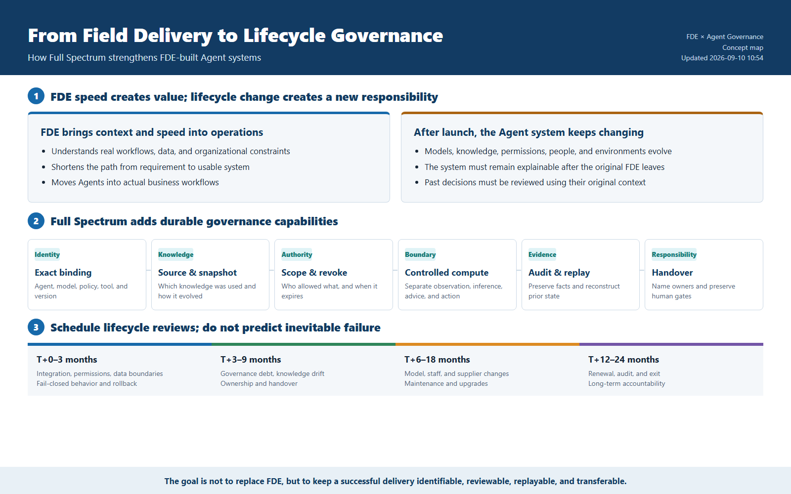
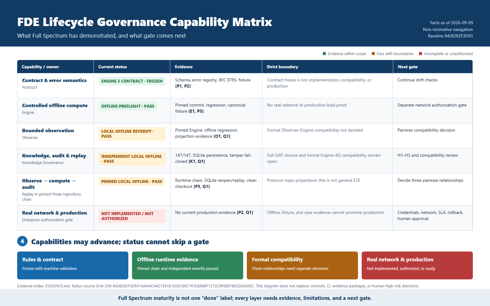
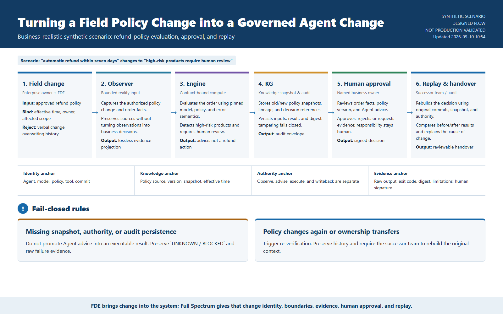

# FDE and Agent Lifecycle Governance

**Publication type:** Working Paper  
**Status:** Non-normative, not peer reviewed  
**Date:** 2026-09-09  
**Author:** Full Spectrum Lab / Codex draft  

## Abstract

Forward-deployed engineering (FDE) is valuable because it places engineering judgment close to a customer's operational reality. The harder problem begins after the first delivery: agents, models, knowledge, permissions, people, and business conditions continue to change. This paper asks how Full Spectrum can help FDE teams preserve identity, knowledge versions, decision boundaries, authorization, evidence, responsibility, handover, and replay across that lifecycle.

This is not a claim that FDE projects inevitably fail. It is a governance proposal for making successful field delivery more durable and independently maintainable.



## The lifecycle gap

An FDE team can make a system useful quickly by learning local workflows and integrating the necessary tools. A production organization must later answer questions that are easy to miss during initial delivery:

- Which agent, model, policy, prompt, tool, and knowledge version produced a decision?
- What authorization existed, and was it valid at that moment?
- Which observations were facts, which were transformations, and which were judgments?
- Can a successor team reproduce the result after the original FDE leaves?
- Can the system preserve historical truth instead of explaining past behavior with current data?

Agent systems make these questions more important because their outputs depend on changing context and composed capabilities, not only on a fixed code path.

## How Full Spectrum complements FDE

| FDE concern | Full Spectrum contribution |
|---|---|
| Field observations | bounded Observer inputs and evidence projections |
| Agent and capability identity | exact version and capability declarations |
| Knowledge integration | source, version, snapshot, provenance, and lifecycle records |
| Runtime decisions | frozen schemas, deterministic boundaries, and explicit error semantics |
| Authorization | scoped permission, expiry, revocation, and fail-closed behavior |
| Handover | commit-bound manifests, limitations, and replay procedures |
| Accountability | persistent audit evidence and named human approval gates |

The intended chain is:

```text
field reality
  -> bounded observation
  -> contract-constrained computation
  -> knowledge and audit persistence
  -> named human decision
  -> reproducible handover and replay
```

Full Spectrum does not replace field judgment, enterprise ownership, legal authority, or operational approval.

## Risk windows as review hypotheses

The following windows are planning hypotheses, not predictions:

| Window | Suggested review focus |
|---|---|
| T+0 to 3 months | integration, permissions, data boundaries, rollback |
| T+3 to 9 months | governance debt, knowledge drift, ownership and handover |
| T+6 to 18 months | model, staff, supplier, and maintenance changes |
| T+12 to 24 months | renewal, audit, exit, and long-term responsibility |

They should be tested against primary sources, counterexamples, and project evidence. Vendor surveys must not be generalized beyond their samples. Named incidents should not be treated as facts without primary-source verification. Commercial disputes may be modeled as mechanisms, but not asserted as an industry-wide outcome without evidence.

## Evidence discipline

Material claims should record `Claim`, `Source`, `Source Type`, `Direct Evidence`, `Inference Level`, `Confidence`, `Counterexamples`, and `Project Implication`.

Design, implementation, local validation, cross-repository compatibility, real-network operation, and production readiness are separate states. Evidence from one state must not silently promote another.

## A practical evaluation model

An FDE-enabled agent project should be tested for whether it can:

1. bind decisions to exact agent, model, policy, tool, and knowledge identities;
2. reject missing or expired authorization;
3. preserve historical evidence without overwriting earlier results;
4. reopen persistent storage and replay the same governed decision;
5. detect tampering and fail closed;
6. let a successor team reproduce the result from fixed commits and manifests;
7. keep network, credential, writeback, and production approval as separate gates.

## Current Full Spectrum boundary



As of the dated repository evidence used for this draft, Full Spectrum has demonstrated a pinned local offline Observer-Engine-Knowledge Governance runtime chain and independent clean-checkout re-verification. Formal pairwise compatibility remains unconfirmed. Real-network implementation is not implemented or authorized, and production readiness remains `NO`.

These limits identify the next engineering work rather than weakening the offline evidence.

## Business-realistic synthetic walkthrough



The walkthrough is a designed synthetic scenario, not a claim of production deployment. It shows how an FDE-delivered policy change can preserve observation, computation, knowledge snapshots, human approval, and replay as separate responsibilities.

## Conclusion

FDE brings context and speed to the field. Full Spectrum can make that delivery durable by preserving the governance context that must survive the original engagement. The target is not more paperwork; it is a system that remains identifiable, reviewable, replayable, transferable, and accountable as agents and organizations change.

