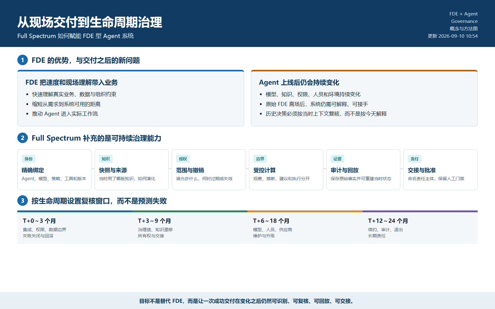
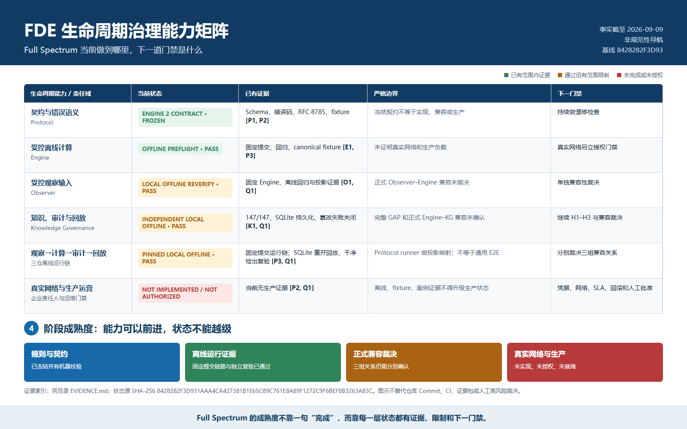
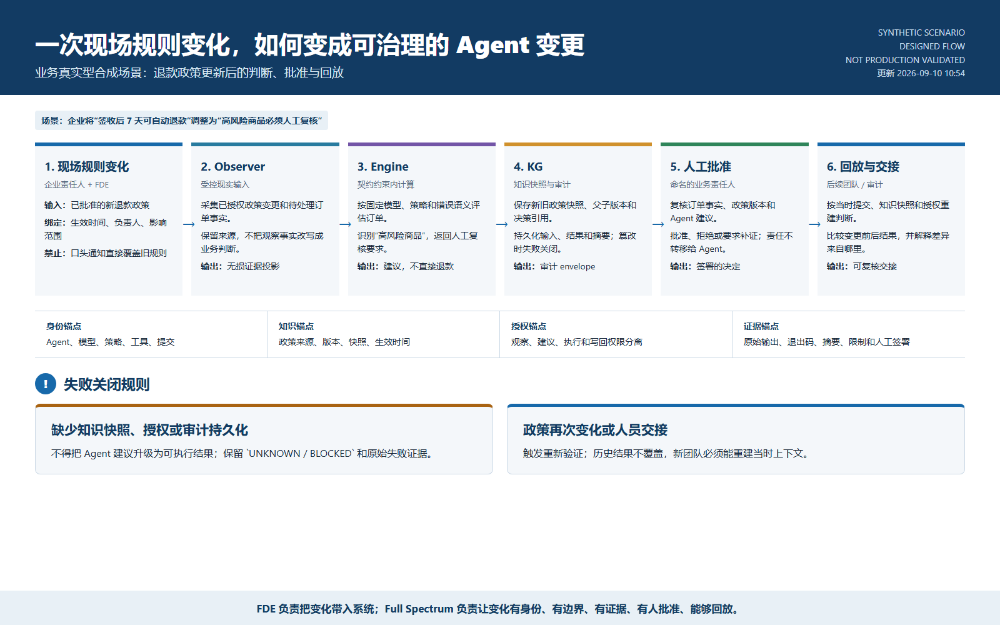

# FDE 与 Agent 生命周期治理

**发布类型：** Working Paper  
**状态：** 非规范性、未经同行评审  
**日期：** 2026-09-09  
**作者：** Full Spectrum Lab / Codex 草稿  

## 摘要

FDE 的价值在于让工程判断贴近客户现场，快速理解流程、数据和组织约束。真正困难的问题通常出现在首次交付之后：Agent、模型、知识、权限、人员和业务条件会继续变化。本文讨论 Full Spectrum 如何帮助 FDE 在整个生命周期中保存身份、知识版本、决策边界、授权、证据、责任、交接和回放能力。

本文不主张 FDE 项目必然失败。它提出的是一套让成功的现场交付更持久、更容易由后续团队独立维护的治理方法。



## 生命周期缺口

FDE 可以通过现场学习和系统集成迅速创造价值，但长期运营仍需回答：

- 当时使用的是哪个 Agent、模型、策略、Prompt、工具和知识版本？
- 当时存在哪些授权，授权是否有效？
- 哪些是观察事实，哪些是转换结果，哪些是业务判断？
- 原 FDE 离场后，接手团队能否复现结果？
- 系统能否保存历史事实，而不是用今天的数据解释过去？

Agent 的输出依赖变化中的上下文和组合能力，因此这些问题比传统固定流程软件更突出。

## Full Spectrum 如何补充 FDE

| FDE 关注点 | Full Spectrum 提供的能力 |
|---|---|
| 现场观察 | 受控 Observer 输入与证据投影 |
| Agent 和能力身份 | 精确版本与能力声明 |
| 企业知识接入 | 来源、版本、快照、谱系与生命周期 |
| 运行决策 | 冻结 Schema、确定性边界与明确错误语义 |
| 授权 | 范围、期限、撤销与失败关闭 |
| 项目交接 | 固定提交、manifest、限制和回放程序 |
| 责任 | 持久化审计证据和命名的人类批准门禁 |

目标闭环是：

```text
现场现实
  -> 受控观察
  -> 契约约束内的计算
  -> 知识与审计持久化
  -> 命名的人类决策
  -> 可复现的交接与回放
```

Full Spectrum 不替代 FDE 的现场判断、企业所有权、法律权力或运营批准。

## 风险窗口是复核假设

| 时间窗 | 建议复核重点 |
|---|---|
| T+0～3 个月 | 集成、权限、数据边界、回滚 |
| T+3～9 个月 | 治理债、知识漂移、所有权和交接 |
| T+6～18 个月 | 模型、人员、供应商和维护变化 |
| T+12～24 个月 | 续约、审计、退出和长期责任 |

这些区间用于安排复核，不是失败预测。供应商调查不得超出样本外推；具体事故在一手来源核验前不得作为确认事实；商业争议可以作为机制推演，但不能无证据地写成行业普遍结果。

## 证据纪律

重要主张应记录：`Claim`、`Source`、`Source Type`、`Direct Evidence`、`Inference Level`、`Confidence`、`Counterexamples` 和 `Project Implication`。

设计、实现、本地验证、跨仓兼容、真实网络和生产就绪是不同状态。任何一级证据都不能静默提升另一级状态。

## 实用评估模型

一个 FDE 赋能的 Agent 项目应检验能否：

1. 将决策绑定到精确 Agent、模型、策略、工具和知识身份；
2. 拒绝缺失或过期授权；
3. 保存历史证据而不覆盖旧结果；
4. 重开持久化存储并回放同一治理决策；
5. 检测篡改并失败关闭；
6. 让接手团队仅凭固定提交和 manifest 复现结果；
7. 将联网、凭据、写回和生产批准保留为独立门禁。

## Full Spectrum 当前边界



截至本文采用的日期化仓库证据，Full Spectrum 已完成固定提交的本地离线 Observer-Engine-Knowledge Governance 运行链和独立干净检出复验。三组正式兼容仍未确认；真实网络未实现、未授权；生产就绪仍为 `NO`。

这些限制不是要隐藏的问题，而是下一阶段工程工作的明确输入。

## 业务真实型合成演练



该演练是业务真实型合成场景，不代表真实客户生产部署。它用于展示 FDE 引入的政策变化如何将观察、计算、知识快照、人工批准和回放保持为相互独立但可追溯的责任。

## 结论

FDE 把上下文和速度带到现场。Full Spectrum 可以保存必须跨越原始交付周期的治理上下文，使系统在 Agent 和组织变化后仍然可识别、可复核、可回放、可交接、可追责。

